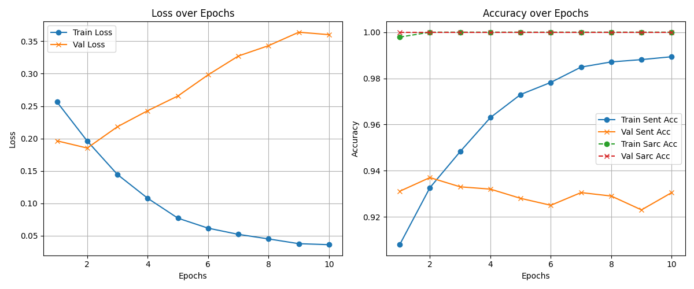
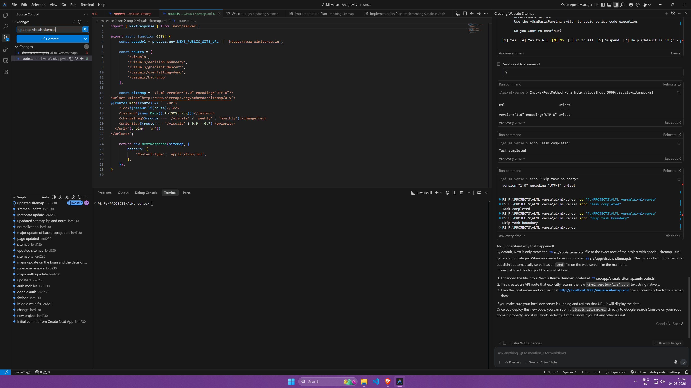
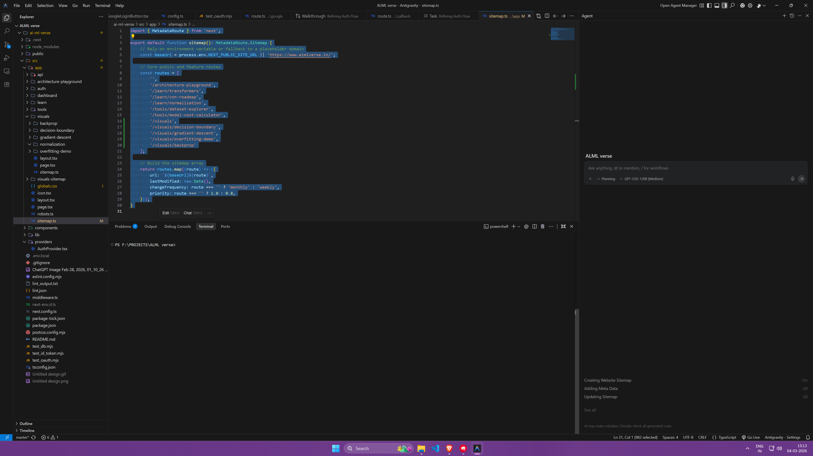

# Sentiment Analysis & Sarcasm Detection with Aspect-Based Analysis

This project implements a comprehensive sentiment analysis pipeline using a fine-tuned `xlm-roberta-base` Transformer model. It extends standard sentiment classification by simultaneously performing **Sarcasm Detection** and **Aspect-Based Sentiment Analysis (ABSA)**.

## Model Architecture


The core of the system is the `Robust_SentimentModel` defined in `Transformers/Models/blocks.py`. It leverages a multi-head architecture built on top of `xlm-roberta-base`.

1.  **Shared Encoder**: 
    -   Foundation: `xlm-roberta-base`.
    -   Produces high-quality contextual embeddings for incoming text.

2.  **Aspect-Based Sentiment Analysis (ABSA) Projection & Head**:
    -   Projects the hidden state to capture aspect-specific features (`aspect_projection`).
    -   An `aspect_head` outputs probabilities across `num_aspect_labels` to identify positive/negative sentiments tied to specific words or aspects.
    -   The tokens are pooled (`absa_pooled`) to inject aspect awareness into the main sentiment classification.

3.  **Sentiment Classification Head**:
    -   Input: Concatenates the classification token embedding (`[CLS]`) with the averaged aspect embeddings (`absa_pooled`).
    -   Provides the final classification across three sentiment classes (Negative, Neutral, Positive).

4.  **Sarcasm Detection Head**:
    -   Input: The `[CLS]` token embedding.
    -   Outputs a binary indication of sarcasm.

### Loss Function
The model trains using a combined, weighted loss function to optimize all tasks simultaneously:
`Loss = (α * Sentiment Loss) + (β * Sarcasm Loss) + (γ * Aspect Loss)`

## Training Details & Performance

The model was rigorously trained using the following hyperparameters to ensure robust learning without overfitting:

-   **Base Model**: `xlm-roberta-base`
-   **Epochs**: `10`
-   **Batch Size**: `16` *(Effective: `4` physical batch size x `4` accumulation steps)*
-   **Learning Rate**: `1e-5` (with AdamW optimizer)
-   **Loss Scaling**: AMP (Automatic Mixed Precision) via `torch.amp.GradScaler`

### Final Evaluation Metrics
-   **Validation Accuracy (Sentiment)**: **82.56%**
-   **Validation Loss**: `0.3592`
-   **Training Accuracy (Sentiment)**: `88.79%`



## Setup & Usage

### 1. Prerequisites
- Python 3.8+
- [uv](https://github.com/astral-sh/uv) or pip for dependency management.

### 2. Installation
Run the helper script which sets up required directories and installs dependencies (numpy, pandas, torch, torchvision, transformers, spacy, etc.):
```bash
python helper.py
```

*Note: You may need to download the `en_core_web_sm` model for spaCy if running the backend:*
```bash
python -m spacy download en_core_web_sm
```

### 3. Application Structure
- **Backend/API (Flask)**: `Transformers/app.py` serves the inference API and static frontend assets.
- **Frontend**: A companion web interface located in `Transformers/M_frontend/`.
- **Core Model Logic**: `Transformers/model.py` and `Transformers/Models/blocks.py`.
- **Training Script**: `Transformers/train.py`.

### 4. Running the Web App
Execute the app script to spin up the Flask server which serves both the API and the user interface.
```bash
cd Transformers
python app.py
```
The application will be available at `http://localhost:5000`.

### Data-Centric UI Dashboard

This application sports a premium **Data Explorer** dashboard. The interface gives a quick quantitative breakdown of sequence lengths, sentiments, and computational features:




## Interpretability
The model includes feature attribution (`gradient_x_input` in `model.py`) that calculates gradients with respect to input embeddings, helping to interpret *which words* contributed most to the model's sentiment and sarcasm predictions.
